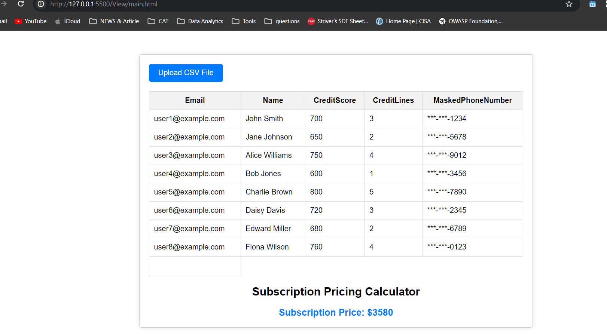

# CSV Web Application

Welcome to the CSV Web Application! This application allows users to upload CSV files, display data from the CSV file, and calculate subscription pricing based on credit score and the number of credit lines mentioned in the CSV.

## Requirements

### CSV Upload Service:
- Create a feature allowing users to upload CSV files.
- Ensure the service efficiently handles large datasets.
- Implement real-time progress indicators to keep users informed during uploads.

### Data Display and Pagination:
- Display the uploaded data on the UI post-upload completion.
- Implement pagination for smooth navigation through large datasets.
- Ensure the UI remains responsive even with extensive data.

### Subscription Pricing Calculator:
- Utilize the uploaded CSV data to develop a Subscription Pricing Calculator.
- Calculate and display subscription pricing based on the uploaded data.

## Subscription Pricing Formula

To calculate the subscription pricing based on credit score and the number of credit lines mentioned in the CSV, use the following formula:

## Technologies Used

- **Frontend**: HTML, CSS, JavaScript
- **Backend**: Node.js, Flask
- **Storage**: local file storage, CSV
- **Deployment**: AWS

## Getting Started

1. Clone this repository to your local machine.
2.  Install Node.js and npm
3. Set up environment variables
4. Run the application locally:
5. Open your web browser and navigate to the application URL.

## Usage

- Upload a CSV file using the provided interface.
- View the uploaded data displayed in a table format with pagination.
- Use the subscription pricing calculator to calculate pricing based on credit score and credit lines.

## Demo

*Caption: This is a screenshot of the CSV Web Application.*
